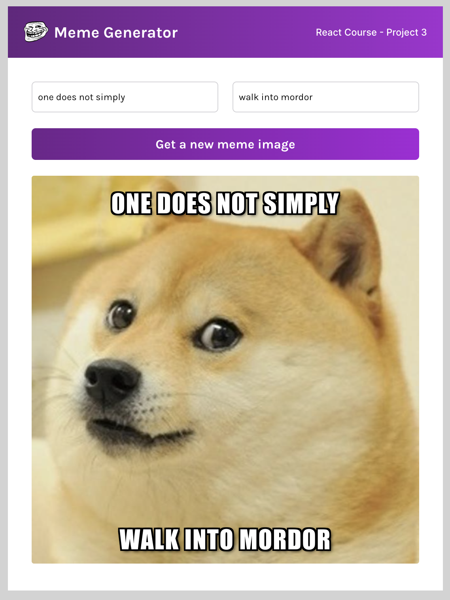

# React Meme Generator
## [Hosted on Netlify](https://hneels-react-meme-generator.netlify.app/)

My third mini-project for the [Scrimba React Course](https://scrimba.com/learn/learnreact). Based on [this Figma design](https://www.figma.com/file/MoLwFPHNHJVrzdFurxHzNV/Meme-Generator).

This interactive React app explores components with props, event listeners, conditional rendering, forms, state (useState) and side effects (useEffect).

This project was bootstrapped with [Create React App](https://github.com/facebook/create-react-app).